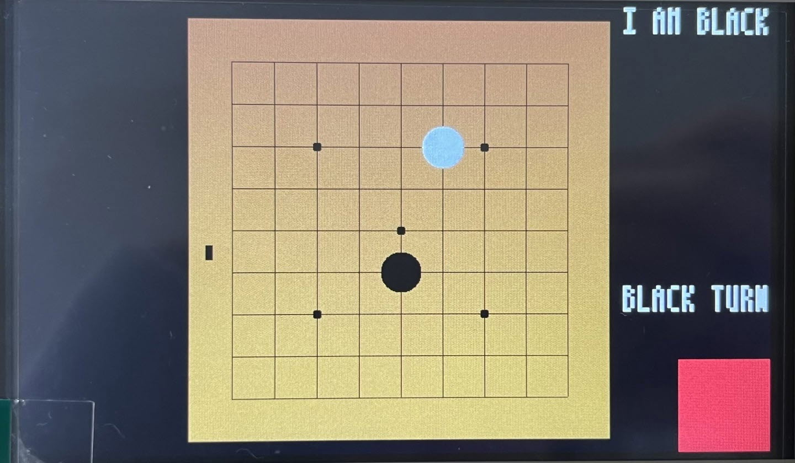

## 🕹️ 오목 게임 (Omok Game)

**리눅스 프레임버퍼 + 클라이언트-서버 구조 기반의 4목 게임**

---

### 📌 프로젝트 개요

C 언어와 리눅스 환경에서 구현한 4목 게임입니다.  
**프레임버퍼를 이용한 UI 구성**과 **TCP 기반의 클라이언트-서버 통신 구조**를 바탕으로,  
양쪽 플레이어가 실시간으로 게임을 진행할 수 있도록 설계되었습니다.

---

### 🖼️ UI 화면 예시

> 실제 구현된 오목판 UI (프레임버퍼 기반 흑백 바둑돌 및 그리드 표시)

---

### 🎬 시연 영상

---

### 👤 담당 역할

- 프레임버퍼를 활용한 오목판 및 게임 상태 UI 구현  
- 터치 입력 처리 및 흑백 바둑돌 렌더링  

---

### 🛠️ 사용 기술

- **Language:**   
- **Platform:**   
- **Protocol:**   
- **Technical Components:**     
- **Toolchain:** 

---

### 📝 회고 (선택)

> 저수준의 디스플레이 렌더링과 네트워크 통신을 함께 다뤄보며  
> 임베디드 시스템에서 UI와 실시간 데이터 흐름을 제어하는 역량을 키울 수 있었습니다.
