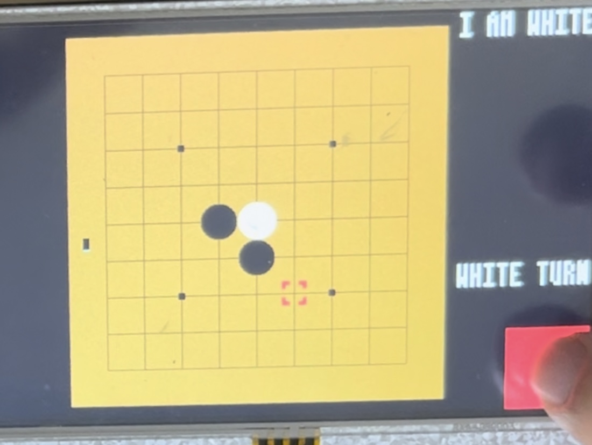

## 🕹️ 오목 게임 (Omok Game)

**리눅스 프레임버퍼 + 클라이언트-서버 구조 기반의 4목 게임**

---

### 📌 프로젝트 개요

C 언어와 리눅스 환경에서 구현한 4목 게임입니다.  
**프레임버퍼를 이용한 UI 구성**과 **TCP 기반의 클라이언트-서버 통신 구조**를 바탕으로,  
양쪽 플레이어가 실시간으로 게임을 진행할 수 있도록 설계되었습니다.

---

### 🖼️ UI 화면 예시 및 설명

  
  

바둑판은 리눅스 프레임버퍼에 직접 접근하여, 픽셀 단위로 그린 격자 형태의 보드로 구성되어 있으며, 각 교차점에 바둑돌을 둘 수 있습니다.
- **우측 상단** `"I AM BLACK"`: 현재 사용자 바둑돌 색상 표시  
- **우측 중앙** `"BLACK TURN"`: 현재 누구의 차례인지 표시  
- **우측 하단 빨간 버튼**: 선택한 위치에 바둑돌을 놓는 **입력 버튼**

🟫 **그리드(Grid)**: 바둑돌을 두기 위한 기준 좌표를 제공하는 세로/가로 선망 구조  
⚫⚪ **바둑돌**: 턴에 따라 흑 또는 백 돌을 표시하며, 프레임버퍼 상에서 원형으로 직접 그려짐  

---

### 🎬 시연 영상

---

### 👤 담당 역할

- 프레임버퍼를 활용한 오목판 및 게임 상태 UI 구현  
- 터치 입력 처리 및 흑백 바둑돌 렌더링  

---

### 🛠 사용 기술

#### 💻 프로그래밍 언어  

#### 🧩 플랫폼 / OS  

#### 🌐 통신 프로토콜  

#### ⚙️ 기술 구성 요소  

#### 🧪 툴체인  

---

### 📝 회고 (선택)

> 저수준의 디스플레이 렌더링과 네트워크 통신을 함께 다뤄보며  
> 임베디드 시스템에서 UI와 실시간 데이터 흐름을 제어하는 역량을 키울 수 있었습니다.
